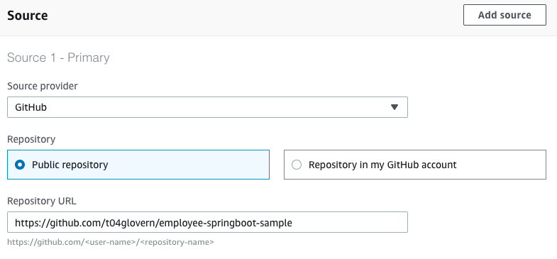
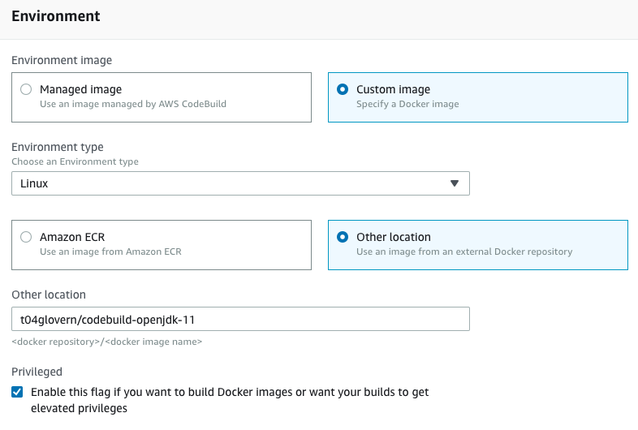
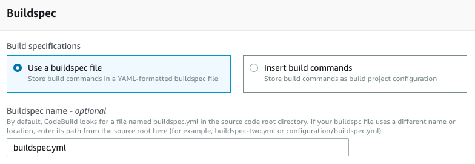
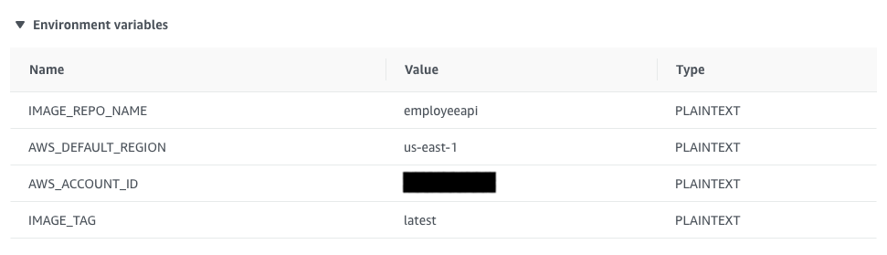

# Employee API


## Quickstart Deployment

Run the following to build & deploy the project to ECR

***NOTE:** You will need to change the instances of `<aws-account-id>` in either of the scripts below to match the ECR repository you build on.*

```bash
# Linux / MacOS
./docker-deploy.sh

# Windows
docker-deploy.bat
```

## buildspec.yml Environment Variables

You will need to ensure that the following environment variables are set for the buildspec to execute correctly in AWS CodeBuild

If your ECR repo was the following:

**123124124**.dkr.ecr.**us-east-1**.amazonaws.com/**employeeapi**:**latest**

* **$IMAGE_REPO_NAME**: *e.g. employeeapi*
* **$AWS_DEFAULT_REGION**: *e.g. us-east-1*
* **$AWS_ACCOUNT_ID**: *e.g. 123124124*
* **$IMAGE_TAG**: *e.g. latest*

## Role Configuration

You will also need to make sure that the role attached to the CodeBuild job has Read/Write permission to ECR.

```json
{
    "Effect": "Allow",
    "Action": "ecr:*",
    "Resource": "*"
}
```

## Setup Images








